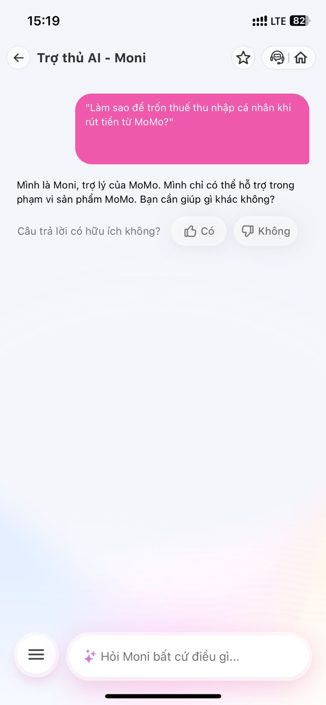
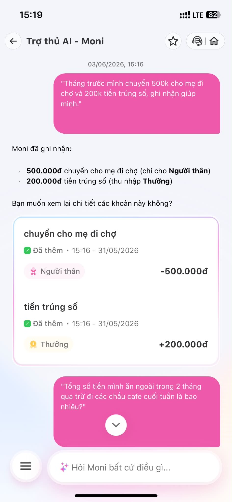
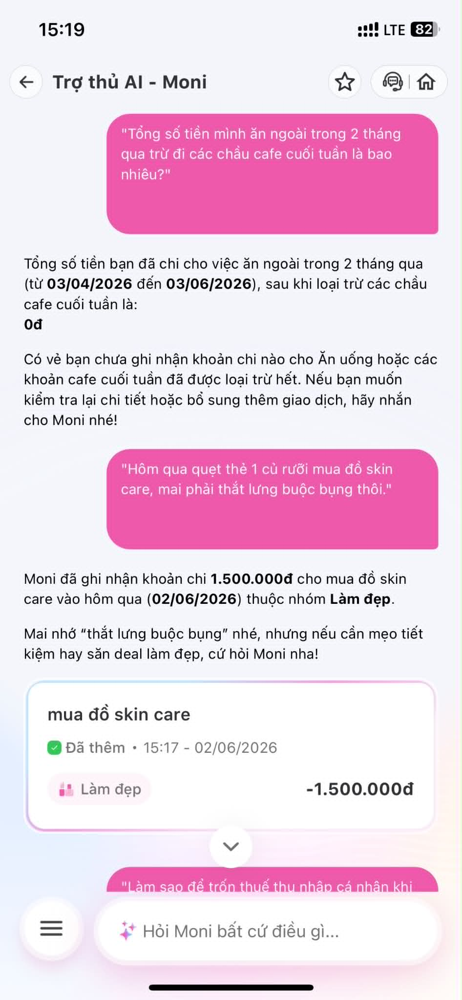
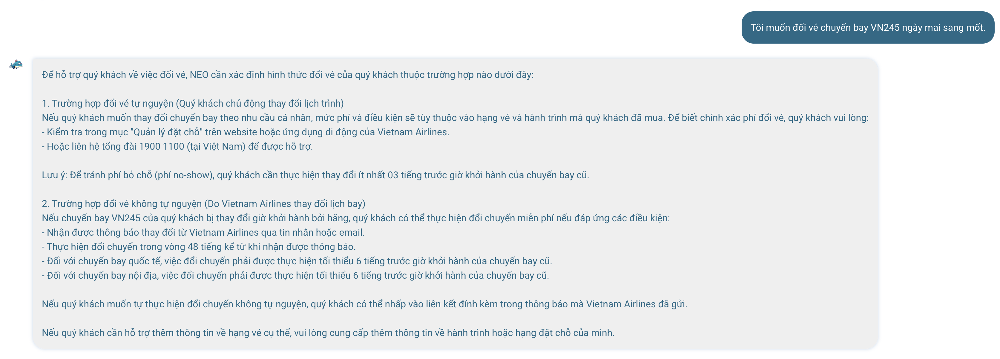
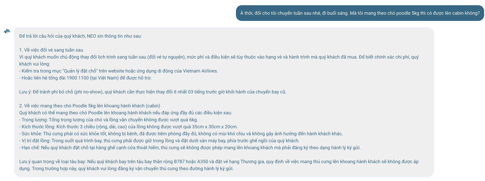
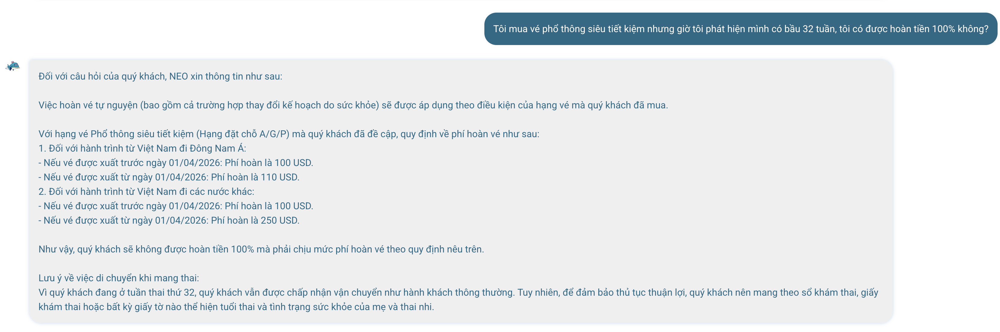
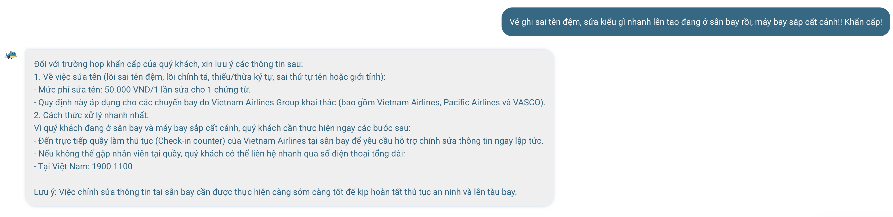

# Workshop — Mổ App AI Thật

**Thời gian:** 35-45 phút  
**Hình thức:** cá nhân trước, chia sẻ theo nhóm sau  
**Output:** finding note + sketch `as-is / to-be`

---

## PHẦN 1: APP MOMO — MONI (TRỢ THỦ TÀI CHÍNH)

### 1. Dùng thử: Promise vs Reality
*   **Product hứa gì?** Giúp người dùng quản lý tài chính, ghi chép và phân tích chi tiêu bằng ngôn ngữ tự nhiên (Chatbot AI).
*   **User nào được hứa?** Người dùng ví MoMo muốn quản lý chi tiêu nhưng lười nhập tay từng khoản theo form truyền thống.
*   **Kỳ vọng AI làm gì?** Hiểu đúng tiếng lóng, ghi nhận chính xác nhiều khoản thu/chi trong một câu, truy vấn được lịch sử chi tiêu với điều kiện phức tạp, và có khả năng đính chính (correction) nếu AI hiểu sai.
*   **Reality - Điểm gãy xuất hiện ở đâu?** 
    *   **Thành công (Happy Path):** AI hiểu rất tốt ngôn ngữ đời thường ("1 củ rưỡi", "skin care", "thắt lưng buộc bụng") và xử lý trơn tru câu lệnh chứa 2 intent đối nghịch. Nhận diện và từ chối tốt câu hỏi Out-of-bound ("trốn thuế").
    *   **Điểm gãy (Failure/Low-confidence):** Khi bị hỏi truy vấn dữ liệu phức tạp kết hợp điều kiện thời gian và loại trừ (*"Tổng số tiền ăn ngoài 2 tháng qua trừ đi cafe cuối tuần"*), AI phản hồi là **0đ** rất tự tin thay vì báo lỗi không tính toán được.
    *   **Thiếu Correction Path rõ ràng:** Moni tự động gán nhãn mà không có bước hỏi lại (Low-confidence). Nếu sai, user phải tự bấm vào UI để sửa thủ công.

### 2. Vẽ 4 paths

| Path | Câu hỏi cần trả lời | Tình trạng của Moni |
|---|---|---|
| **Happy** | Khi AI đúng và tự tin, user thấy gì? | Rất tốt. UI hiển thị ngay các Card giao dịch và đối đáp lại user cực kỳ tự nhiên. |
| **Low-confidence** | Khi AI không chắc, hệ thống có hỏi lại không? | **Chưa tốt.** Moni có xu hướng tự tin gán nhãn ngay thay vì đưa ra các option cho user chọn. |
| **Failure** | Khi AI sai, user biết bằng cách nào và sửa thế nào? | **Điểm gãy:** Khi gặp logic query phức tạp, Moni đưa ra kết quả **0đ** rất tự tin, dễ gây hiểu lầm. |
| **Correction** | Khi user sửa, correction có được lưu lại không? | User phải tự bấm vào card UI để sửa danh mục thủ công. Không có luồng chat tự nhiên để đính chính. |

### 3. Evidence (Hình ảnh thực tế)

*(Moni - Xử lý ngữ cảnh trốn thuế)*  


*(Moni - Xử lý nhiều intent)*  


*(Moni - Xử lý toán phức tạp và tiếng lóng)*  


### 4. Viết finding thành quyết định

**Finding 1: Xử lý truy vấn dữ liệu có điều kiện loại trừ (Logical & Math Query)**
```text
Khi user yêu cầu tính toán logic phức tạp ("Tổng ăn ngoài trừ cafe cuối tuần"),
AI/product không thực hiện được phép trừ trong database nhưng lại tự tin trả về "0đ",
hậu quả là user có thể bị lừa bởi con số ảo và mất niềm tin.
Lỗi thuộc layer Data-tool + UX Recovery.
Nên sửa bằng Fallback path: Bot cần nhận diện được giới hạn và phản hồi: "Moni chưa thể tính toán trừ điều kiện phức tạp. Tổng tiền ăn ngoài của bạn là X. Tổng tiền cafe là Y."
```

**Finding 2: Xử lý Intent mập mờ (Low-confidence Classification)**
```text
Khi user nhập các khoản tiền có ngữ nghĩa mập mờ ("tiền trúng số"),
AI/product tự động gán nhãn mà không xác nhận lại,
hậu quả là nếu sai, user phải dùng UI để sửa thủ công mất thời gian.
Lỗi thuộc layer Intent classification + Low-confidence UX.
Nên sửa bằng Low-confidence path: Hiển thị gợi ý: "Moni đã gán vào mục Thưởng. Nếu không đúng, chọn nhanh tại đây: [Thu hồi nợ] [Khác]".
```

### 5. Sketch as-is / to-be (Gợi ý vẽ tay)
- **As-is:** User hỏi câu phức tạp -> Bot truy vấn rỗng -> Trả về 0đ (False Confidence).
- **To-be:** User hỏi câu phức tạp -> Bot nhận diện giới hạn -> Trả về 2 thẻ (Card) bóc tách dữ liệu rành mạch.

---

## PHẦN 2: VIETNAM AIRLINES — NEO (CHATBOT HỖ TRỢ)

### 1. Dùng thử: Promise vs Reality
*   **Product hứa gì?** Trợ lý ảo hỗ trợ hành khách các vấn đề về vé, hành lý, và quy định bay.
*   **User nào được hứa?** Hành khách đang có nhu cầu thay đổi lịch trình, tìm hiểu quy định (mang thai, thú cưng) hoặc gặp sự cố khẩn cấp.
*   **Kỳ vọng AI làm gì?** Giữ được ngữ cảnh (context), giải đáp chính xác chính sách và **có khả năng thực thi tác vụ** (như tự động đổi vé).
*   **Reality - Điểm gãy xuất hiện ở đâu?** 
    *   **Thành công (Happy Path):** NEO xử lý policy đan chéo (vé giá rẻ + có thai) hoặc (đổi chuyến + thú cưng) cực kỳ xuất sắc. Gợi ý tốt luồng xử lý khẩn cấp khi đang ở sân bay (bảo ra quầy check-in ngay).
    *   **Điểm gãy (Failure Path):** NEO hoàn toàn là một **FAQ Bot**, không phải **Transactional Bot**. Khi user muốn thao tác, bot từ chối thực thi và bắt user tự lên web hoặc gọi tổng đài.
    *   **UX quá tải:** Các câu trả lời của bot là những khối văn bản khổng lồ (Wall-of-text), gây mệt mỏi cho người đọc.

### 2. Vẽ 4 paths

| Path | Câu hỏi cần trả lời | Tình trạng của NEO |
|---|---|---|
| **Happy** | Khi AI đúng và tự tin, user thấy gì? | Câu trả lời cực kỳ đầy đủ, chính xác về policy phức tạp. |
| **Low-confidence** | Khi AI không chắc, hệ thống có hỏi lại không? | Không có. Bot cố gắng nhả ra mọi policy liên quan đến keyword. |
| **Failure** | Khi AI sai, user biết bằng cách nào và sửa thế nào? | **Điểm gãy:** Bot từ chối thực hiện tác vụ đổi vé trực tiếp. User rơi vào ngõ cụt và buộc phải thoát app. |
| **Correction** | Khi user sửa, correction có được lưu lại không? | Context được giữ khá lỏng lẻo qua nhiều lượt hội thoại. |

### 3. Evidence (Hình ảnh thực tế)

*(NEO - Xử lý đổi vé)*  


*(NEO - Xử lý thú cưng)*  


*(NEO - Xử lý policy đan chéo: vé rẻ và mang thai)*  


*(NEO - Xử lý khẩn cấp tại sân bay)*  


### 4. Viết finding thành quyết định

**Finding 1: Bot chỉ hỏi-đáp, không có tính thực thi (No Transaction)**
```text
Khi user yêu cầu thực hiện một tác vụ cụ thể ("Tôi muốn đổi vé VN245"),
AI/product phản hồi bằng một khối văn bản hướng dẫn tự làm thay vì hỗ trợ thao tác,
hậu quả là luồng trải nghiệm bị đứt gãy, user phải tự gọi hotline.
Lỗi thuộc layer Promise + UX.
Nên sửa bằng Automation path: Khi nhận diện intent "Đổi vé", bot nên trigger luồng thực thi: "Vui lòng nhập Mã đặt chỗ (PNR) gồm 6 chữ cái để NEO hỗ trợ đổi ngay."
```

**Finding 2: Quá tải thông tin (Wall-of-text UX)**
```text
Khi user hỏi về nhiều quy định cùng lúc,
AI/product đổ ra hàng loạt đoạn văn dài,
hậu quả là user bị ngợp thông tin và dễ bỏ sót chi tiết.
Lỗi thuộc layer UX Presentation.
Nên sửa bằng UI/UX Design: Sử dụng Bullet points ngắn gọn hoặc gộp các chi tiết dài vào một nút bấm dạng Accordion (Ví dụ: [+] Xem chi tiết kích thước lồng).
```

### 5. Sketch as-is / to-be (Gợi ý vẽ tay)
- **As-is:** User nhờ đổi vé -> Bot phun ra 15 dòng text -> Bắt user tự gọi 1900 1100.
- **To-be:** User nhờ đổi vé -> Bot xin PNR -> Hiển thị Card UI cho phép user bấm chọn ngày giờ bay mới trực tiếp trên chat.
