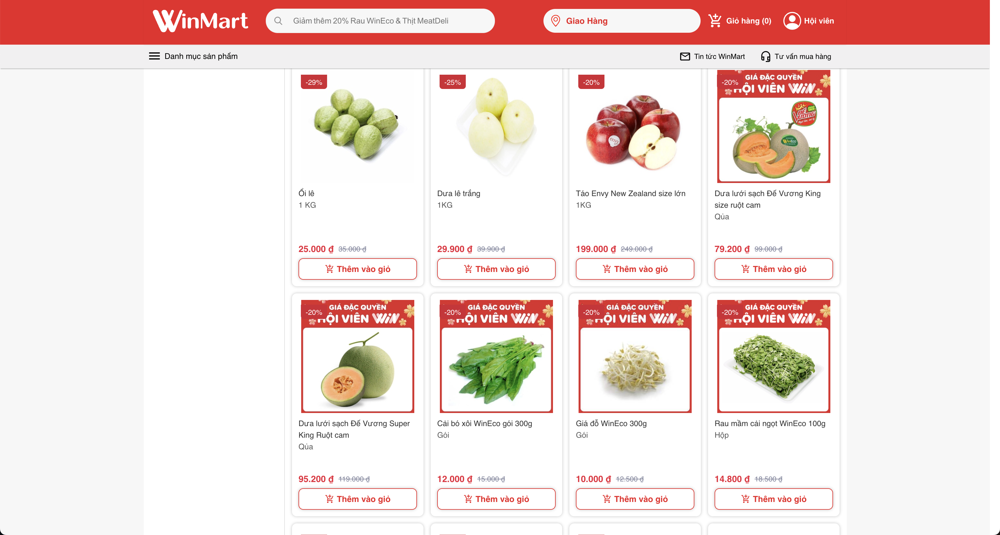
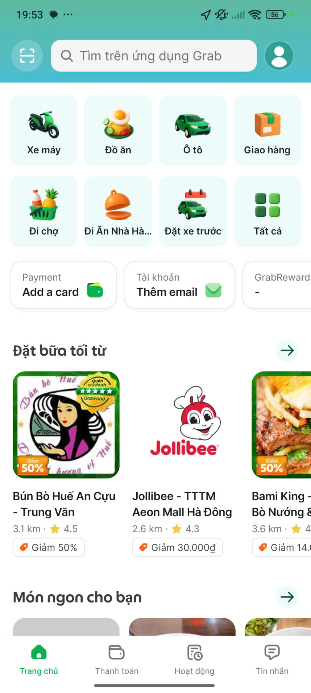

# Template — Evidence Pack

Nộp kèm thin SPEC cuối Day 05.

## 1. Nhóm và track

**Tên nhóm:** Đặng Ngọc Bách (MSV: 2A202600661)
**Track:** Siêu thị / Grocery
**Product/app đã chọn:** Bách Hóa Xanh (hoặc Coopmart, VinID)
**Build slice đang nghĩ:** Đi chợ bằng thực đơn 1 chạm (AI Recipe to Cart)

## 2. Self-use evidence

Nhóm tự dùng app/workflow và ghi lại điểm gãy.

| Observation | Screenshot/link | Path liên quan | Điều học được |
|---|---|---|---|
| Lên mạng tra công thức nấu ăn, sau đó sang app siêu thị search thủ công từng củ hành, quả cà chua. Rất lười và tốn thời gian. |  | Failure | User thà ra chợ mua còn nhanh hơn lướt app nhặt từng cọng hành. |
| Quên mua nguyên liệu phụ (hành, tỏi) làm món ăn hỏng bét. |  | Failure | App truyền thống không có tính năng cross-sell theo món ăn mà chỉ cross-sell theo loại hàng. |

## 3. User / review / social evidence

Nguồn có thể là review App Store/Play, group, comment, phỏng vấn nhanh, hoặc nguồn public khác.

| Quote / review / observation | Nguồn | User là ai? | Pain/failure mode |
|---|---|---|---|
| "Nghĩ trưa nay ăn gì mệt hơn cả làm việc. Đặt đồ nấu thì toàn quên hành ngò." | Group Facebook "Hội Yêu Bếp" | Dân văn phòng / Nội trợ bận rộn | Cognitive load (tải trọng nhận thức) khi nghĩ món và đi chợ quá lớn. |
| "App siêu thị dạo này hay hết hàng, order đủ đồ về nấu lẩu thì báo hết thịt bò, tức lộn ruột." | Review App Store | Người dùng mua sắm online | Không đồng bộ tồn kho thực tế lúc lên ý tưởng nấu ăn. |

Nếu chưa có nguồn ngoài nhóm, ghi rõ:
```text
Đây là giả định. Nhóm sẽ kiểm bằng [Phỏng vấn nhanh 3 đồng nghiệp nữ trong công ty] trước checkpoint M1 Day 06.
```

## 4. Competitor / analog evidence

| App / mô hình tham khảo | Họ xử lý task này thế nào? | Pattern học được | Có áp dụng trong 1 ngày không? |
|---|---|---|---|
| Cookpad / Savoury Days | Có công thức nấu ăn rất ngon nhưng không bấm mua nguyên liệu được. | User phải nhảy (context switch) giữa 2 app. | Có thể áp dụng bằng cách làm Mockup 1 khung chat lên thực đơn tích hợp giỏ hàng. |

## 5. Evidence -> Insight

```text
Evidence nổi bật nhất:
Nghĩ món ăn và đi nhặt từng nguyên liệu vào giỏ hàng là trải nghiệm cực kỳ ma sát (high friction), và hay quên đồ lặt vặt.

Insight:
User [nội trợ bận rộn] không chỉ gặp [vấn đề mua đồ ăn].
Thật ra họ cần [một quản gia biết rõ thói quen ăn uống của gia đình để lên thực đơn và đi chợ hộ],
vì [áp lực công việc làm cạn kiệt sự sáng tạo, và họ lười lặp lại việc chọn từng nhãn hiệu quen thuộc trên app].

Opportunity:
AI có thể giúp bằng cách [tự động lên thực đơn dựa trên Prompt của user, đối chiếu với Tồn kho (Inventory) siêu thị và Thói quen mua sắm cũ (vd: luôn mua rau hữu cơ)],
giúp user [đi chợ trong 10 giây], và kết nối thẳng [đơn hàng cho nhân viên siêu thị gom đồ (picker) giao cho shipper y như đặt đồ ăn online].
```

## 6. Evidence đổi SPEC như thế nào?

- [ ] Đổi user chính.
- [ ] Đổi pain statement.
- [x] Đổi build slice.
- [ ] Đổi Auto/Aug decision.
- [ ] Đổi 4 paths.
- [ ] Đổi failure mode.
- [ ] Đổi owner/test plan.

Ghi rõ 1-2 thay đổi quan trọng:

```text
Trước evidence, nhóm định... làm chatbot trả lời câu hỏi mẹo nấu ăn.
Sau evidence, nhóm đổi thành... luồng "Thực đơn tự động add vào giỏ hàng".
Lý do: Chatbot nấu ăn thì dùng Gemini cũng được (Thiếu defensibility). Còn tự add vào giỏ hàng thì tận dụng được Moat (Kho hàng và Hệ sinh thái mua sắm) của App siêu thị.
```
